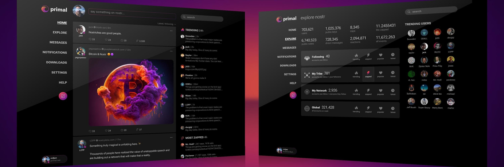

<!-- Improved compatibility of back to top link: See: https://github.com/othneildrew/Best-README-Template/pull/73 -->

<!--
*** Thanks for checking out the Best-README-Template. If you have a suggestion
*** that would make this better, please fork the repo and create a pull request
*** or simply open an issue with the tag "enhancement".
*** Don't forget to give the project a star!
*** Thanks again! Now go create something AMAZING! :D
-->

<!-- PROJECT SHIELDS -->
<!--
*** I'm using markdown "reference style" links for readability.
*** Reference links are enclosed in brackets [ ] instead of parentheses ( ).
*** See the bottom of this document for the declaration of the reference variables
*** for contributors-url, forks-url, etc. This is an optional, concise syntax you may use.
*** https://www.markdownguide.org/basic-syntax/#reference-style-links
-->
[![Contributors][contributors-shield]][contributors-url]
[![Forks][forks-shield]][forks-url]
[![Stargazers][stars-shield]][stars-url]
[![Issues][issues-shield]][issues-url]
[![MIT License][license-shield]][license-url]

<!-- PROJECT LOGO -->
 

  

<h3 align="center">Primal</h3>

  

    Featuring easy onboarding, fast & snappy UI, ability to explore Nostr, and create & manage custom feeds
     
    <a href="https://github.com/PrimalHQ/primal-web-app"><strong>Explore the docs »</strong></a>
     
     
    <a href="https://github.com/PrimalHQ/primal-web-app">View Demo</a>
    ·
    <a href="https://github.com/PrimalHQ/primal-web-app/issues">Report Bug</a>
    ·
    <a href="https://github.com/PrimalHQ/primal-web-app/issues">Request Feature</a>
  

<!-- TABLE OF CONTENTS -->

  
Table of Contents

  <ol>
    <li>
      <a href="#about-the-project">About The Project</a>
      <ul>
        <li><a href="#built-with">Built With</a></li>
      </ul>
    </li>
    <li>
      <a href="#getting-started">Getting Started</a>
      <ul>
        <li><a href="#setup">Setup</a></li>
        <li><a href="#development">Development</a></li>
      </ul>
    </li>
    <li><a href="#contributing">Contributing</a></li>
    <li><a href="#license">License</a></li>
    <li><a href="#contact">Contact</a></li>
  </ol>

<!-- ABOUT THE PROJECT -->
## About The Project

    

(<a href="#readme-top">back to top</a>)

### Built With

[![Solidjs][Solidjs]][Solidjs-url]

[![Typescript][Typescript]][Typescript-url]

[![Sass][Sass]][Sass-url]

(<a href="#readme-top">back to top</a>)

<!-- GETTING STARTED -->
## Getting Started

### Setup

Clone this repo then run the following commands:
- `npm install` (to install dependencies)
- `npm run dev` (to stand a local instance)

The caching service and the upload server urls can be configured with the following two environment variables which could be passed in via command line or read from the `.env` file:
- `PRIMAL_CACHE_URL` (caching service websocket url)
- `PRIMAL_UPLOAD_URL` (upload server websocket url)

### Development

This code is still very much a work-in-progress. Expect major changes of the structure and logic to be happening somewhat frequently.
Major features are still missing.

(<a href="#readme-top">back to top</a>)

<!-- CONTRIBUTING -->
## Contributing

Read more about contributions in [CONTRIBUTING.md](CONTRIBUTING.md).

(<a href="#readme-top">back to top</a>)

<!-- LICENSE -->
## License

Distributed under the MIT License. See [LICENSE](LICENSE) for more information.

(<a href="#readme-top">back to top</a>)

<!-- CONTACT -->
## Contact

- Moysie - [@moysie](https://primal.net/moysie)

Project Link: [https://github.com/PrimalHQ/primal-web-app](https://github.com/PrimalHQ/primal-web-app)

(<a href="#readme-top">back to top</a>)

<!-- MARKDOWN LINKS & IMAGES -->
<!-- https://www.markdownguide.org/basic-syntax/#reference-style-links -->
[contributors-shield]: https://img.shields.io/github/contributors/PrimalHQ/primal-web-app.svg?style=for-the-badge
[contributors-url]: https://github.com/PrimalHQ/primal-web-app/graphs/contributors
[forks-shield]: https://img.shields.io/github/forks/PrimalHQ/primal-web-app.svg?style=for-the-badge
[forks-url]: https://github.com/PrimalHQ/primal-web-app/network/members
[stars-shield]: https://img.shields.io/github/stars/PrimalHQ/primal-web-app.svg?style=for-the-badge
[stars-url]: https://github.com/PrimalHQ/primal-web-app/stargazers
[issues-shield]: https://img.shields.io/github/issues/PrimalHQ/primal-web-app.svg?style=for-the-badge
[issues-url]: https://github.com/PrimalHQ/primal-web-app/issues
[license-shield]: https://img.shields.io/github/license/PrimalHQ/primal-web-app.svg?style=for-the-badge
[license-url]: https://github.com/PrimalHQ/primal-web-app/blob/master/LICENSE.txt
[product-screenshot]: https://primal.net/assets/primal_iphone-834937d2.png
[Solidjs]: https://img.shields.io/badge/solid-000000?style=for-the-badge&logo=solid&logoColor=white
[Solidjs-url]: https://www.solidjs.com
[Typescript]: https://img.shields.io/badge/typescript-000000?style=for-the-badge&logo=typescript&logoColor=white
[Typescript-url]: https://www.typescriptlang.org
[Sass]: https://img.shields.io/badge/sass-000000?style=for-the-badge&logo=sass&logoColor=white
[Sass-url]: https://sass-lang.com
